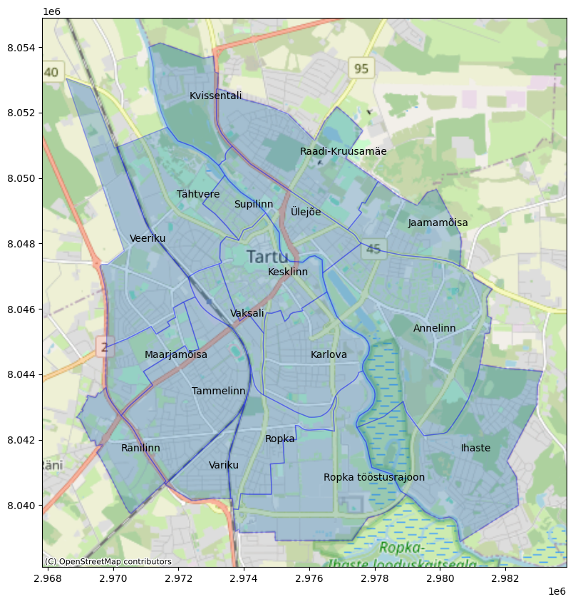
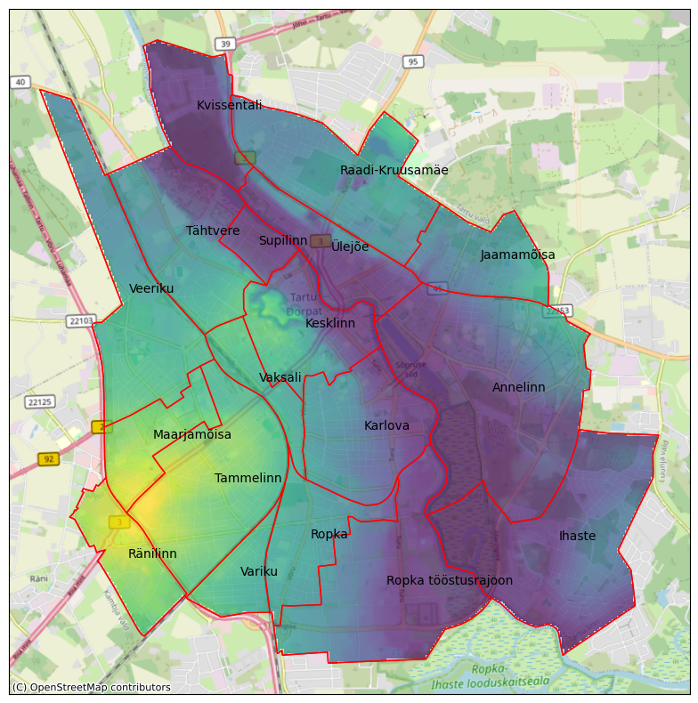
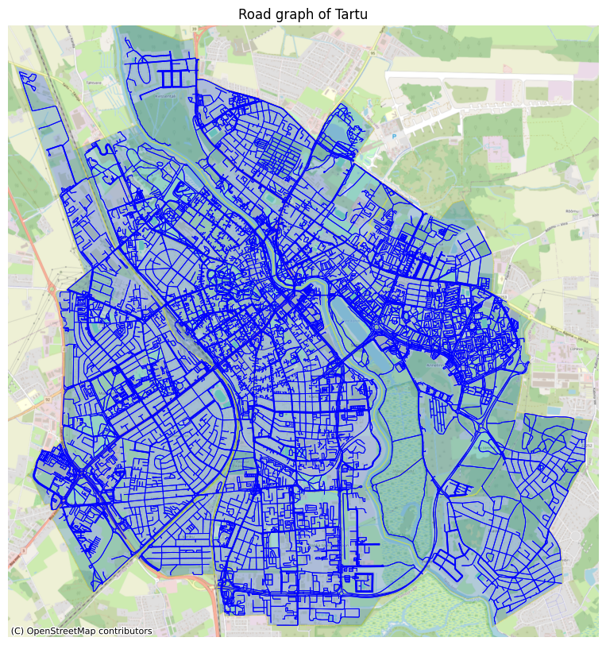
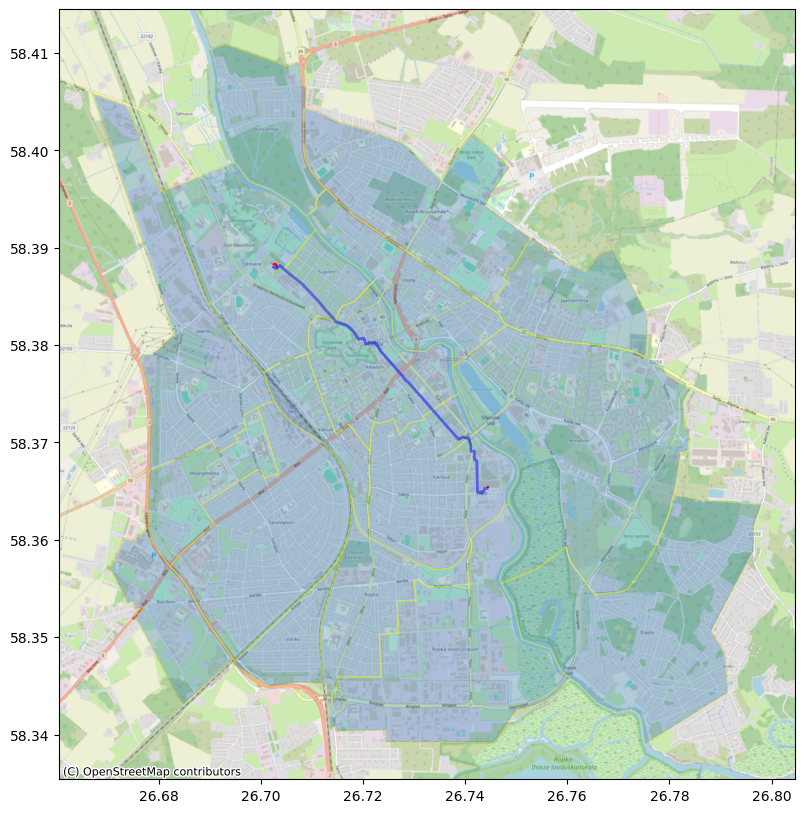
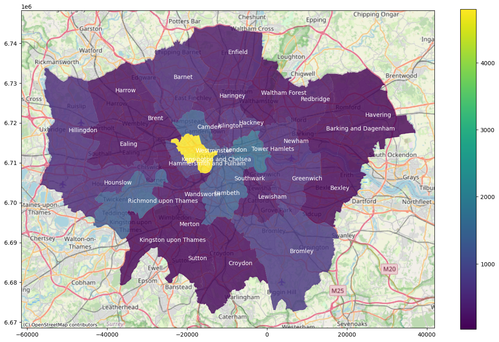
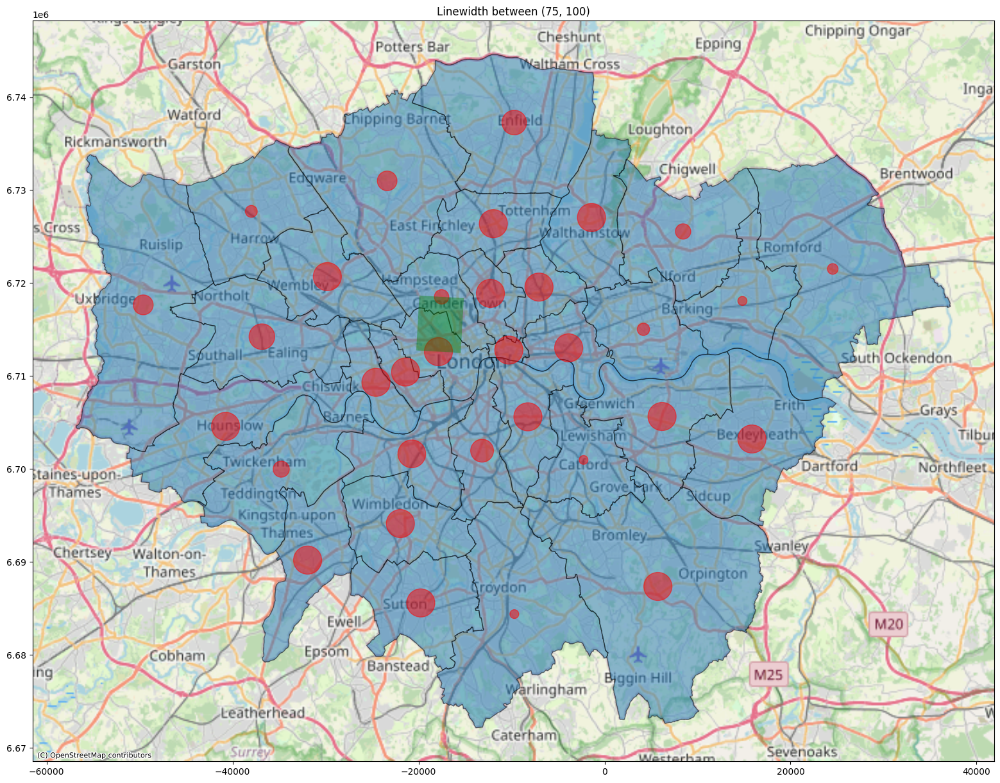
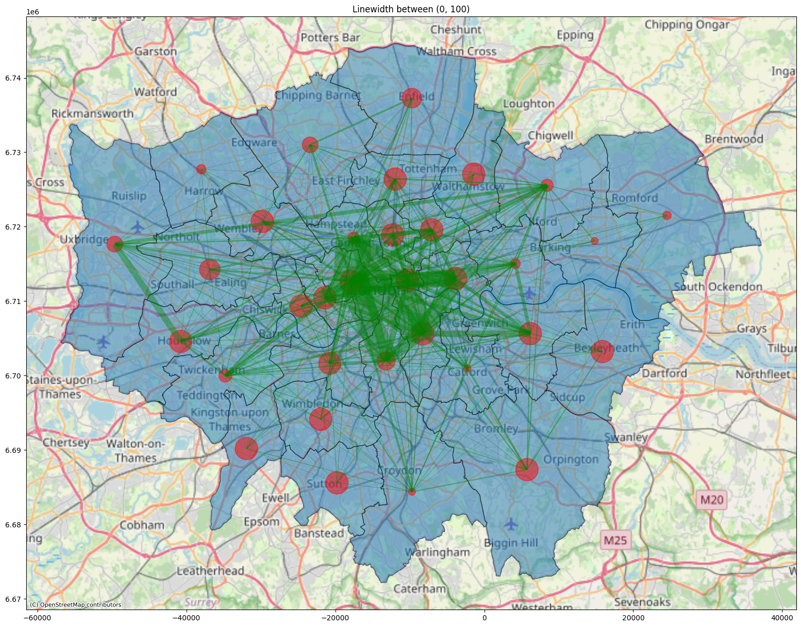

# Geospatial Data Analysis
The repository has two files geospatial-analysis.ipynb and OSM_Tartu_analysis.ipynb

Both of the notebooks involve anlaysis of geospatial data

## OSM_Tartu_analysis.ipynb

### Problem Definition

The objective of this project is to analyze geographic and elevation data for Tartu, Estonia, to support spatial planning and pathfinding within the city. Using OpenStreetMap (OSM) data, elevation data, and shortest path algorithms, the project aims to answer the following questions:

- District Mapping: How can we accurately delineate and label administrative districts within Tartu using OSM data?
- Elevation Analysis: What is the elevation profile across Tartu, and how can we visualize these elevation changes to inform city planning and infrastructure development?
- Optimal Routing: What is the shortest path between two random locations within Tartu, and how can this routing be visually represented for practical navigation or analysis?

### Dataset

- OSM data from osmnx library
- Elevation data from geoportaal.maaamet.ee

### Strategies for data anaysis

- Extracting districts in Tartu from OSM
- Extracting elevation data fromm Estonia and Tartu
- Calculating shortest path for rrandomly chosen points in Tartu

### Results

- Extracted districts in Tartu with their names

- Extracted elevation data for Tartu

- Extracted Tartu road network

- Calculated shortest path from Laulupeo pst 25 to Sõbra 58

## geospatial-analysis.ipynb

### Problem Definition

The goal of this analysis is to understand the spatial and temporal distribution of photos taken in London based on OpenStreetMap (OSM) data. Specifically, we aim to:

- Extract and Define London Districts: Use OSM data to extract the boundaries and areas of all districts (boroughs) within London, setting up a spatial context for analysis.

- Temporal Analysis: Conduct a time-based analysis of photo data to determine the distribution of photos by:

    - Year: Identify the years with the highest and lowest numbers of photos taken.
    - Month: Analyze seasonal trends to understand which months have the highest photo-taking activity.

- Spatial Analysis by Borough: Identify which London boroughs are most popular for photo-taking by counting the number of photos taken in each borough.

- Origin-Destination (OD) Movement Analysis:

    - Develop an OD matrix to study the movement patterns of users between boroughs.
    - Aggregate data by unique user and analyze movement patterns between boroughs, sorted by the date each photo was taken.

### Dataset
Dataset was acquired from kaggle.com [Available here](https://www.kaggle.com/datasets/amiralisa/flickr_london/data)

Dataset consists of:
- Two files of 10000 and 20000 rows of photo records gathered from Flickr website API.
- Includes locations in the city of London
- Photos are taken between 2014 and 2019
- Data columns: photo id, title, description, favorites rate, taken time, latitude, longitude, photo owner id, gender, occupation, city, country

### Strategies for data anaysis

- Extracting districts in London from OSM
- Time analysis of how many number of photos were taken each year and each month
- Location analysis of which borough has most of the photos taken
- Origin destination (OD) matrix among the boroughs in London
    - Grouped by unique user
    - Sorted by date of the photo taken

### Results

- London Boroughs

- Most photos are taken in year 2019
- Most photos are taken in Westminster
- Based on the OD matrix, poeple move between Westminster and Camden the most

#### Plotted OD matrix for the highest value

#### Plotted OD matrix for all values

